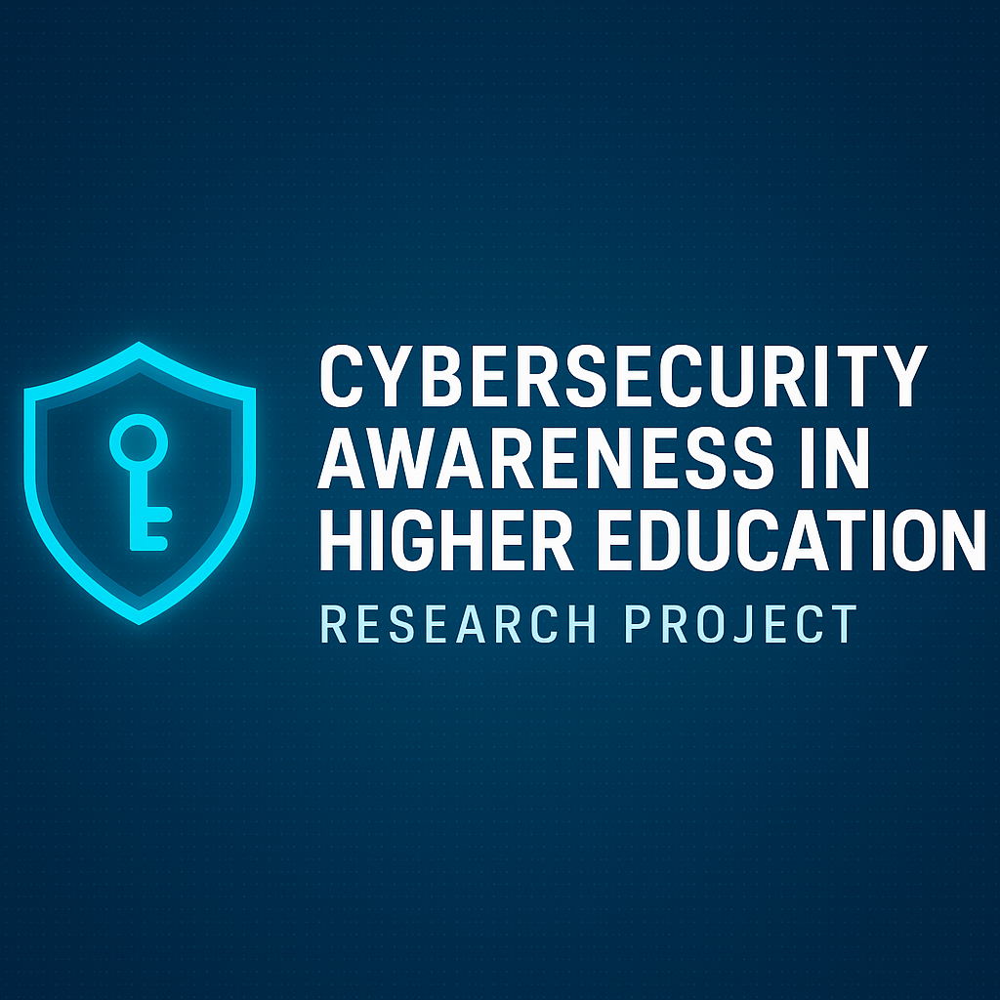

  

# Improving Cybersecurity Awareness at NOVA
### A Research-Based Open Letter & Cybersecurity Policy Proposal  

By **Haytham Abouelfaid**

---

## 🔍 Overview
This repository contains a researched open letter written for an ENG 111 assignment at Northern Virginia Community College (NOVA).  
A standard English assignment was transformed into a **professional cybersecurity research project** addressing real vulnerabilities affecting college students.

The letter analyzes cybersecurity risks students face and proposes actionable solutions NOVA can implement immediately.

---

## 🛡 Problem Summary
College students are one of the most common targets for cybercriminals due to:

- Weak or reused passwords  
- Unsafe public Wi-Fi usage  
- Poor phishing detection  
- Limited cybersecurity education  
- High reliance on digital platforms  

These lead to identity theft, financial fraud, academic account compromise, and long-term credit damage.

---

## 🎓 Purpose of This Project
The goal is to persuade NOVA administrators — specifically the **IT Department** and **Office of Student Affairs** — to implement:

1. **Mandatory Cybersecurity Awareness Training**
2. **Continuous Cybersecurity Initiatives**

Both solutions are supported by credible peer-reviewed research.

---

## 🚀 Proposed Solutions

### **1. Required Cybersecurity Course for First-Year Students**
A semester course covering:
- Phishing identification  
- Password hygiene  
- MFA  
- Device updates  
- Safe network usage  

### **2. Ongoing Cybersecurity Awareness**
- Monthly newsletters  
- Scam alerts  
- Update reminders  
- Interactive workshops  

These improve digital safety campus-wide.

---

## 📊 Research Sources Used
- Armas et al., *Building a Cybersecurity Culture in Higher Education*  
- Hobbs, *Cybersecurity Awareness in Higher Education*  
- National Cybersecurity Alliance, *Cybersecurity Tips for Students*  

Full MLA citations are included in `/paper/works_cited.md`.

---

## 📁 Project Structure
│
├── README.md
│
├── paper/
│ ├── open_letter_haytham_abouelfaid.pdf
│ ├── open_letter_haytham_abouelfaid.docx
│ ├── open_letter_text.md
│ ├── works_cited.md
│ └── annotated_bibliography.md
│
└── sources/
├── armas_et_al_cybersecurity_culture.pdf
├── hobbs_cybersecurity_gaps.pdf
└── nca_cybersecurity_tips.html

---

## 🧑‍💻 About the Author
**Haytham Abouelfaid**  
IT & Cybersecurity Student  
Northern Virginia Community College  

Focused on cybersecurity fundamentals, IT support, SOC tools, and real-world cybersecurity research.

---

## ⭐ Why This Project Matters
This project showcases:
- Research writing  
- Cybersecurity knowledge  
- Policy proposal skills  
- Awareness of real cyber risks  
- Initiative + professionalism  

A strong piece for portfolios, internships, and cybersecurity recruiters.

---
